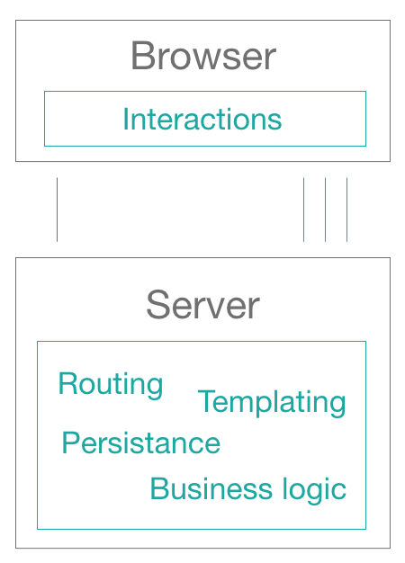

## Fantastic architectures (*and where to find them*)

### A talk by [Salvatore Laisa](https://www.salvatorelaisa.blog) @ MilanoJS 15/01/2019

---

## Table of contents

* About me
* Disclaimer
* Quick history of UI Development
* SPA
* Downsides
* Available choices
* Closing remarks

---

## About me

* [Bitrock](https://bitrock.it)
  * Head of UI Engineering
  * Deputy CTO
  * we're hiring 🤓
* Kung fu & Tai Chi practitioner
* slow gamer
* twitter/instagram: moebiusmania
* no more FB...

---

---

## Disclaimer

### (Obviously) we will not talk about specific frameworks or technologies.

---

## Quick history of UI Development

### late 90s: static pages

### early 2000: server side applications

### 2005: AJAX (Google Maps, Gmail, ecc)

### 2012: Rise of AngularjS & SPAs

### 2015: React, SPA dominates the market...

### ...and now?

---

## S.P.A. pros

* faster loading times
* decoupling of UI & backend
* UI responsiveness
* feels like a real application
* [insert yours]

---

## Is S.P.A. a silver bullet architecture?

### what if my application(s) grows (really big) ?

---

## S.P.A. downsides

> Beware: this doesn't mean they are "not cool" now!

* one-framework-to-rule-them-all, version included
* you can easily run into memory leaks
* functionality domains are not decoupled
* it's a monolith
* architectural bottleneck (monolith above microservices)

---

---

## Alternatives to S.P.A.

> The following architectures are not meant to be mutually exclusives

---

## M.P.A.(s)
Multi Page Application(s). Bringing the **routing back to the server** and triggering a new full refresh of the page, freeing memory in the process.

* 😎 You can use multiple frameworks
* 😎 Fewer possibilities to run out of memory on the client
* 😐 Smaller monoliths?
* 😵 backend & frontend may or may not be decoupled
* 😵 Full refresh = flash of contents

---

## Micro frontends

Why dot not apply the **microservice concept** to frontend also?

Very similar to the M.P.A. approach, but each frontend is responsible of a single domain.

- 😎 You can use multiple frameworks
- 😎 Per domain teams
- 😎 No more monoliths
- 😎 Backend & frontend always decoupled
- 😐 Requires good strategies for code sharing
- 😐 Not every framework plays nicely with the "external world"

---

## S.C.S.
Self contained systems. Separating the functionalities into many independent systems.

- 😎 Perfect scenario for micro-frontends
- 😎 Full stack per domain teams 
- 😐 Huge pardigm shift
- 😐 Be extra-careful on strategies for code sharing

---

## Closing remarks

* did you ever used one of these solutions in production? **Yes**
* are these all the options we have available? **No**
* do you discourage to still develop a S.P.A. ? **Context is the king**
* but I wanted some code! **sorry...**

---

---

# THANKS 🙏

### ( slides written without a presentation tool, this is good old Markdown )

Niffler images are owned by Warner Bros pictures.

